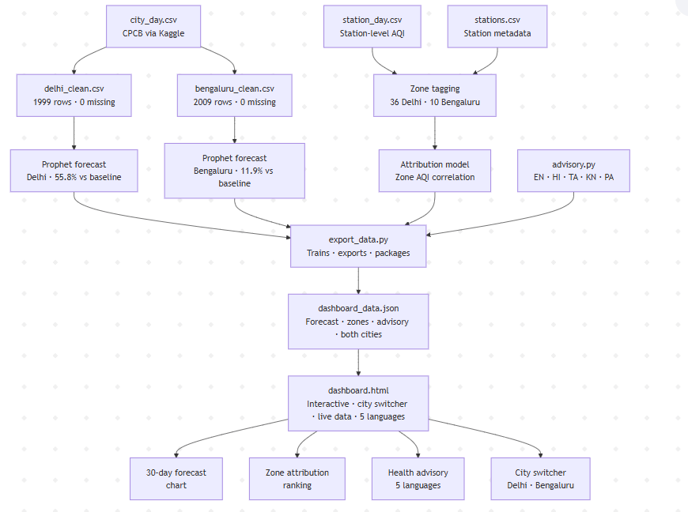

# AI-Powered Urban Air Quality Intelligence Platform
### ET AI Hackathon 2026 — Problem Statement #5

An AI platform that moves cities from **reactive monitoring** to **proactive, evidence-based intervention** — not just measuring air quality, but predicting it and explaining why it's bad.

## What it does
- **Forecasting** — Predicts AQI 30 days ahead using Facebook Prophet, trained on 5+ years of real CPCB data
- **Source Attribution** — Identifies which zone types (Traffic/Industrial/Residential/Institutional) drive pollution using real station-level data
- **Multilingual Advisory** — Auto-generates citizen health advisories in English, Hindi, Tamil, Kannada, and Punjabi
- **Interactive Dashboard** — Live web dashboard with city switcher, zone explorer, and date-based forecast lookup

## Cities covered
| City | Stations | Model Accuracy | Data |
|---|---|---|---|
| Delhi | 36 zones | 55.8% better than naive baseline | 2015–2020 |
| Bengaluru | 10 zones | 11.9% better than naive baseline | 2015–2020 |

## Key findings
- Traffic zones in Delhi show AQI **49% higher** than city average (Anand Vihar: 355 avg AQI)
- Traffic zones in Bengaluru show AQI **21% higher** than city average (City Railway Station: 111 avg AQI)
- Models validated against persistence baseline on highest-volatility winter periods

## Tech stack
- **Forecasting:** Facebook Prophet (time-series)
- **Data:** CPCB via Kaggle (Air Quality Data in India 2015–2020)
- **Attribution:** Station-level AQI correlation with zone classification
- **Advisory:** deep-translator (Google Translate API)
- **Dashboard:** HTML/CSS/JavaScript with live JSON data pipeline
- **Pipeline:** Python (pandas, scikit-learn, prophet)

## How to run
1. Install dependencies: `pip install pandas prophet scikit-learn deep-translator flask`
2. Run data export: `python export_data.py`
3. Start dashboard: `python -m http.server 8000`
4. Open: `http://localhost:8000/dashboard.html`

## Project structure
| File | Purpose |
|---|---|
| `export_data.py` | Trains models + generates dashboard_data.json |
| `attribution_logic.py` | Zone insight functions for both cities |
| `advisory.py` | Multilingual health advisory generation |
| `dashboard.html` | Interactive web dashboard |
| `evaluate.py` / `bengaluru_evaluate.py` | Baseline validation scripts |
| `delhi_clean.csv` / `bengaluru_clean.csv` | Cleaned city datasets |

## Data sources
- CPCB Air Quality Data (via Kaggle: rohanrao/air-quality-data-in-india)
- Station metadata from CPCB monitoring network